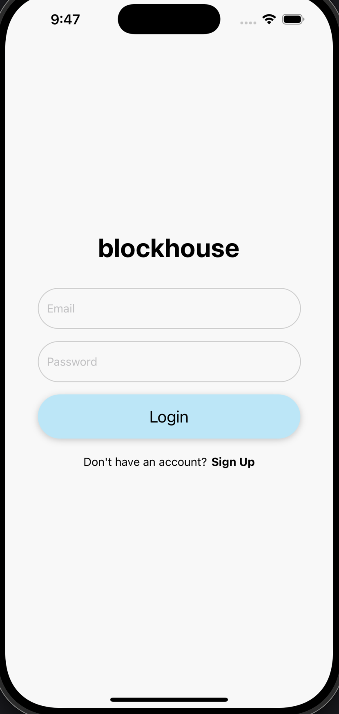
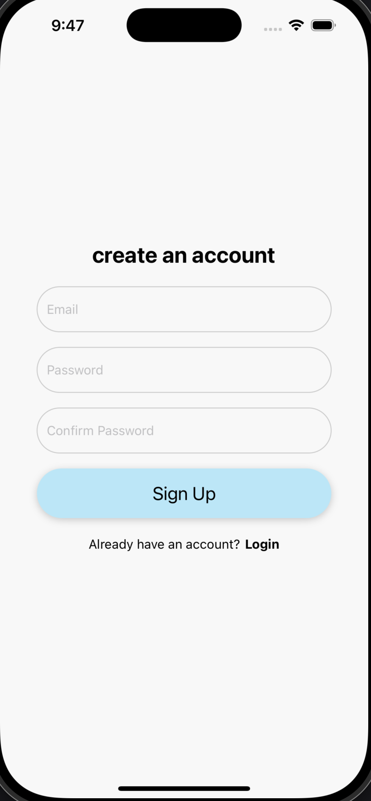

# Blockhouse Auth

BlockhouseAuth is a React Native starter application with preset auth screens for login and signup with modern styling, input validation, and a testing suite. It leverages modern React Native components and libraries to deliver a seamless user experience across iOS and Android platforms.

---

## Features

### Login and Signup screens

<div style="display: flex; justify-content: space-evenly">


</div>

---

## Prerequisites

Before running the app, ensure you have the following installed:

- **Node.js** (>= 16.x)
- **npm** (>= 7.x) or **yarn** (>= 1.x)
- **Watchman**
- **React Native CLI**
- **Xcode** (for iOS development)
- **Android Studio** (for Android development)

---

## Getting Started

Follow these steps to set up and run the app locally:

### 1. Clone the Repository

```bash
git clone https://github.com/your-username/blockhouse_auth.git
cd blockhouse_auth
```

### 2. Install Dependencies

```bash
npm install
```

### 3. Rebuld native modules

```bash
# rebuild native modules
npm run postinstall
# or
npx react-native-rebuild
```

### 4. Regenerate iOS Pods

```bash
cd ios
pod install
cd ..
```

### 5. Clean and Rebuild

```bash
# clean build cashes
npx react-native clean-project-auto
```

### 6. Run the App

#### iOS:

```bash
npx pod-install
npx react-native run-ios
```

#### Android:

```bash
npx react-native run-android
```

---

## Development Workflow

### Code Linting

To ensure code quality, run the linter:

```bash
npm run lint
```

### Running Tests

Run the test suite with:

```bash
npm test
```

---

## Folder Structure

```
blockhouse_auth
├── android               # Android-specific files
├── ios                   # iOS-specific files
├── src                   # Application source code
│   ├── components        # Reusable UI components
│   ├── screens           # App screens
│   └── App.tsx           # Entry point
├── babel.config.js       # Babel configuration
├── metro.config.js       # Metro bundler configuration
├── package.json          # Project dependencies
└── README.md             # Project documentation
```

---

## Dependencies

- **React Native** (https://reactnative.dev/)
- **React Navigation** (https://reactnavigation.org/)
- **Metro** (https://facebook.github.io/metro/)

---

## Contributing

Contributions are welcome! To contribute:

1. Fork the repository.
2. Create a feature branch (`git checkout -b feature/your-feature`).
3. Commit your changes (`git commit -m 'Add some feature'`).
4. Push to the branch (`git push origin feature/your-feature`).
5. Open a Pull Request.

---

## Additional Documentation

- [Continuous Integration and Deployment](docs/CICD.md)
- [Expanding the Pipeline](docs/EXPANDING_CICD.md)

## License

This project is for demonstration purposes only.

---

## Acknowledgments

Special thanks to the React Native community for their excellent tools and support.
